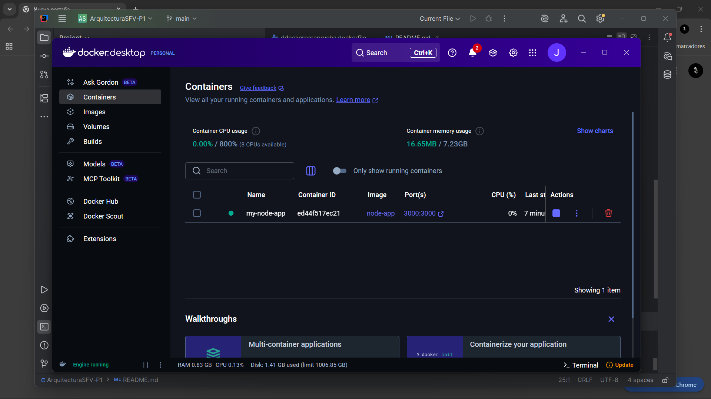
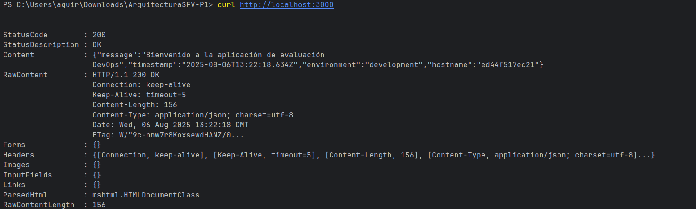

# ArquitecturaSFV-P1

# Evaluación Práctica - Ingeniería de Software V

## Información del Estudiante
- **Nombre:Johan Daniel Aguirre Arias**
- **Código: A00395554**
- **Fecha: 6/08/2025**

## Resumen de la Solución
No se realizo implementacion de ninguna clase mas alla del docker

## Dockerfile
se decidio usar un docker file con la version alpine de node.js por su rapidez adicionalmente se realizo
se decidio usar variables de entorno dentro del contenedor por conveniencia de acceso al contendor.

## Script de Automatización
N/A

## Principios DevOps Aplicados
1. IAC

## Captura de Pantalla

## Mejoras Futuras
1. se podrian poner alguna clase de escaneo continuo (cada x tiempo) para saber si el contendor sigue con vida
2. se podria poner un .dockerexclude para evitar que se suba todo lo de package.json
3. se podrian poner varias instancias dependiendo el entorno ej: una para prueba y una para correr

## Instrucciones para Ejecutar
La aplicacion entregada solo cuenta con el dockerfile por lo cual se debera de hacer el build, el run y usar un comando
para comprobar y/o para ver dentro del contenedor.

comandos usados:

docker build -t node-app -f ddockerparaprueba.dockerfile .

docker run -d -p 3000:3000 --name my-node-app node-app (se puede cambiar el my-node-app por el nombre que se quiera usar)

curl http://localhost:3000 (comprobamos la conexion al docker y nos devuelve el contenido bruto de la pagina)

docker exec -it my-node-app sh (para comprobar dentro del contenedor)

